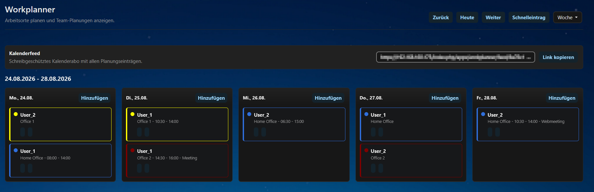
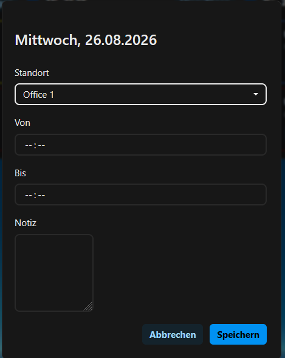
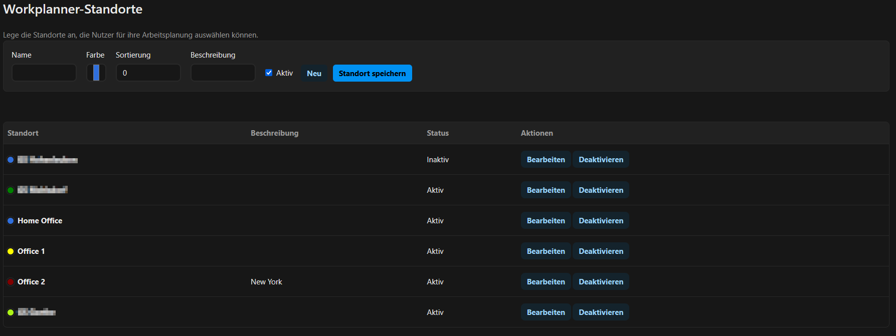
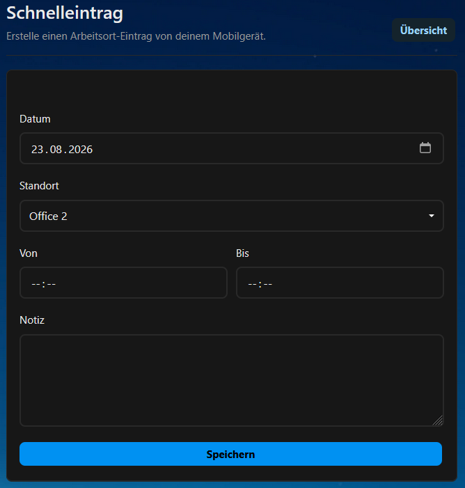

# Workplanner

Workplanner is a Nextcloud app for planning team work locations.

Administrators can manage available locations in the Nextcloud administration settings. Users can add their planned work location in a shared weekly or monthly overview. Past plans remain visible but can no longer be changed.

## Screenshots

## Features

- Shared weekly and monthly planning overview
- Location management for administrators
- Multiple plans per day
- Optional time range and notes
- Read-only handling for past entries
- Public read-only calendar feed with tokenized URL
- Mobile quick entry page for creating personal plans
- English and German translations
- Styling based on Nextcloud design variables, including dark mode support

## Requirements

- Nextcloud 30 or newer
- PHP version supported by the installed Nextcloud server

## Installation

Install the app through the Nextcloud App Store when available, or place the app folder named `workplanner` in the Nextcloud `apps` directory and enable it from the Apps administration page.

## License

AGPL-3.0-or-later
